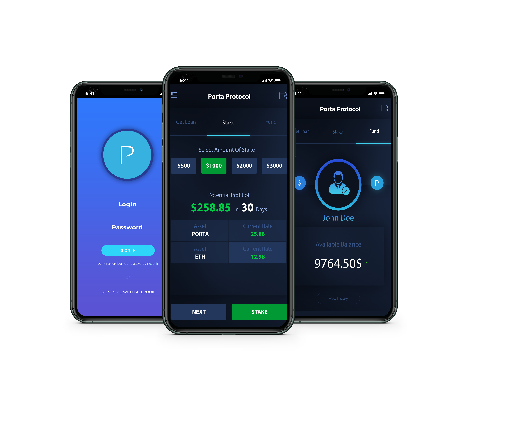

<!-- PROJECT LOGO -->
 

  

  <h2 align="center">Porta Protocol</h2>

  

    #DeFi on Your Mobile
     
    <a href="https://portaprotocol.com/portapaper.pdf"><strong>Read PortaPaper »</strong></a>
     
     
    <a href="https://portaprotocol.com/">About</a>
    <a href="https://portaprotocol.com/#features">Best Features</a>    
    <a href="https://portaprotocol.com/#contact">Contact</a>    
    <a href="https://twitter.com/portaprotocol">Twitter</a>    
    <a href="https://www.reddit.com/user/PortaProtocol">Reddit</a>    
    <a href="https://medium.com/@portaprotocol">Medium</a>    
    <a href="https://discord.gg/8JaaaNH">Discord</a>

    DeFi crosschain peer to peer lending / borrowing, payment platform with staking and Mobile Application features. We will add real use-cases to decentralized crosschain lending platforms. Users will be able to get flash loan and make instant payments; anytime, anywhere by using Porta Mobile Application.
Porta token will be liquidity fuel for Porta protocol platform.

  

  

    We aim to be a major P2P lending / borrowing payment platform which contributes to the community adaptation to DeFi.

 <h4 align="center">Flash Loan - Instant payment</h4>

You can get flash loan anytime, from any place on Porta Protocol P2P lending platform, and use the borrowed money to make payment by using Porta mobile application.

 
 <h4 align="center">Porta Mobile App</h4>

- Get Flash Loan
- Borrow Money
- Make Payment
- Send/ Receive Fund
- Stake Your Tokens

 
 <h4 align="center">Staking</h4>

62,500 PORTA is allocated for staking rewards. Porta Token stake will start at 25 October. You can stake by using Porta Mobile App. or Porta Staking Dashboard.
(Staking APR -daily- : 0.25% - 0.35%)

1st Year: 18,750 PORTA 
2nd Year: 15,625 PORTA 
3rd Year: 12,500 PORTA 
4th Year: 9,375 PORTA 
5th Year: 6,250 PORTA

 
 <h4 align="center">Portanomics</h4>

Max. Supply: 250,000 Porta 
Team: 25,000 Porta 
Staking : 62,500 Porta 
Marketing: 12,500 Porta 
Presale: 100,000Porta 
Uniswap: 50,000 Porta 
%15 of presale funds will be used for BuyBack-Burn.

 
 

<a href="https://portaprotocol.com/">visit www.portaprotocol.com for more</a>
  

